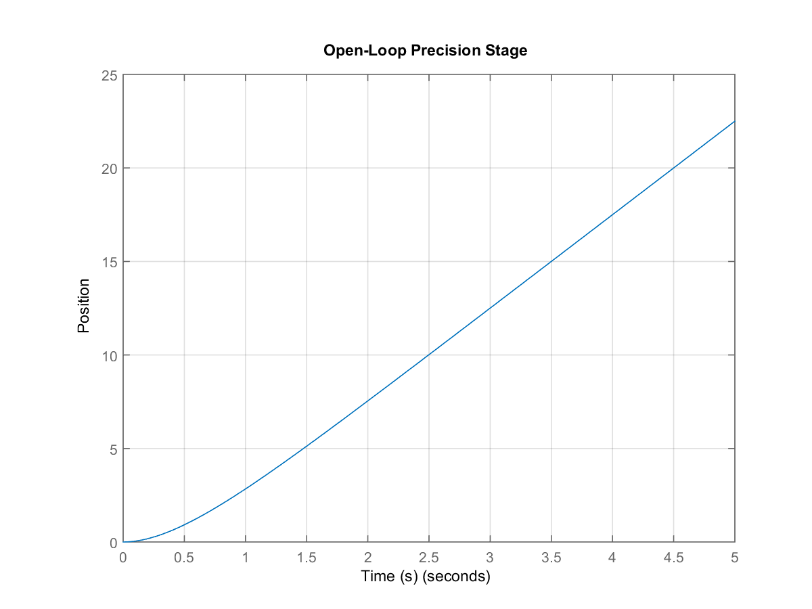
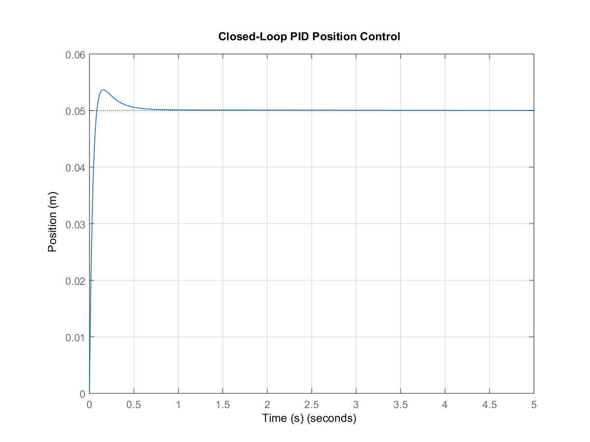
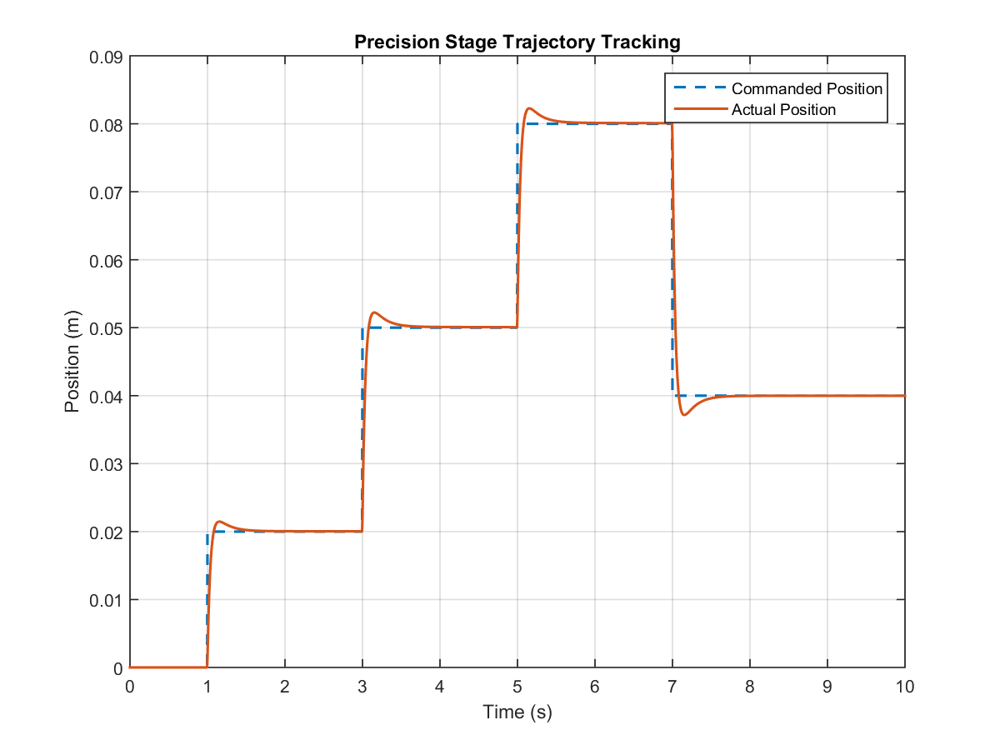
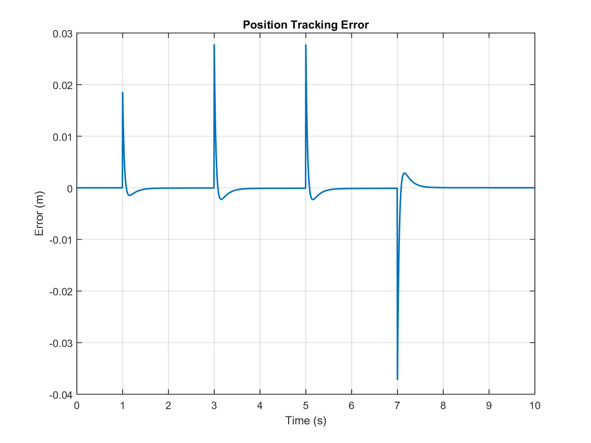
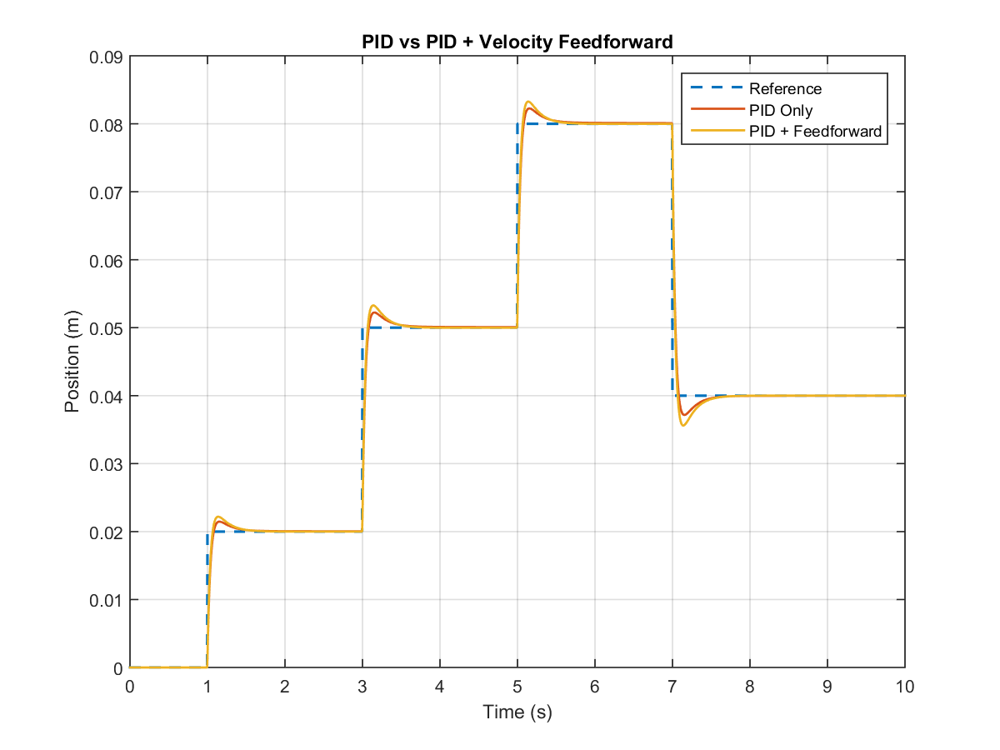
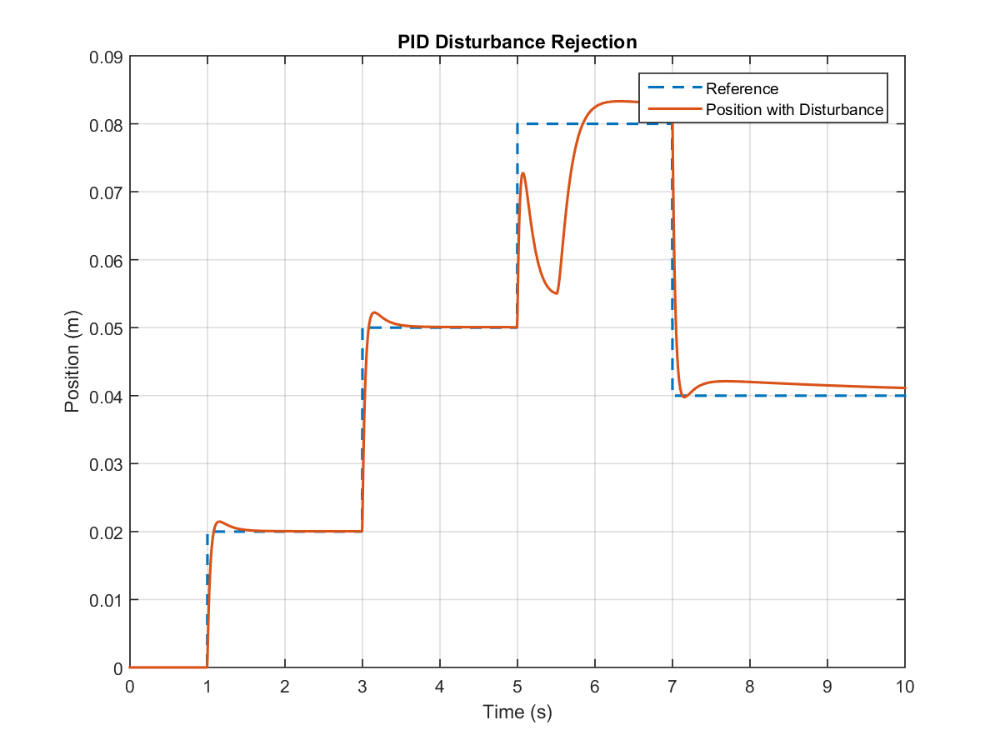
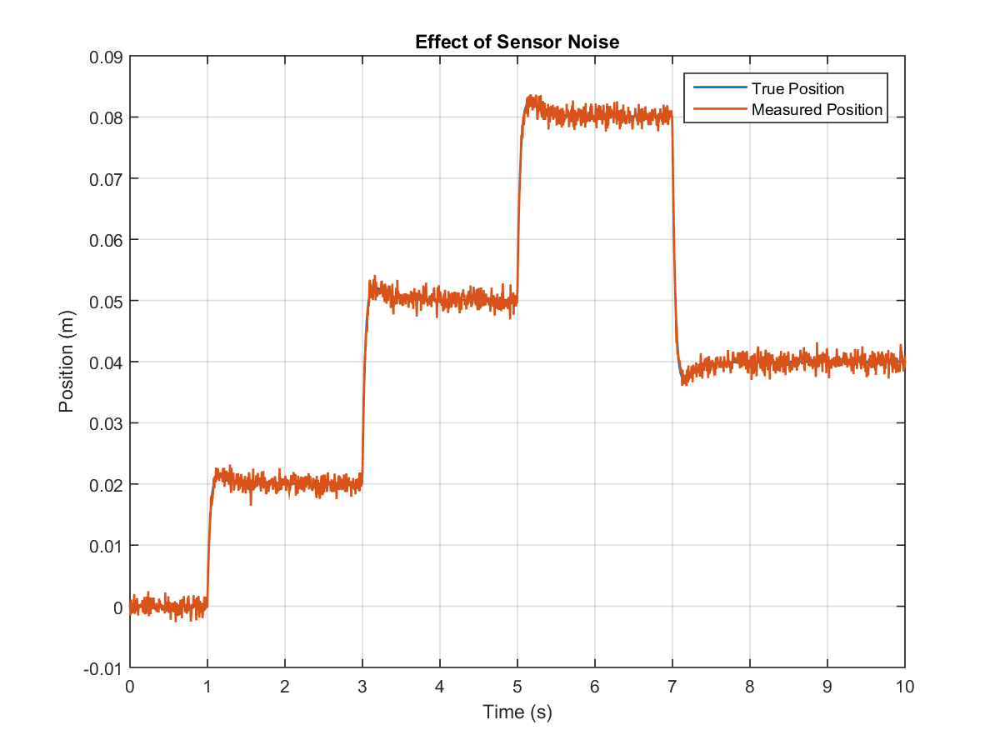
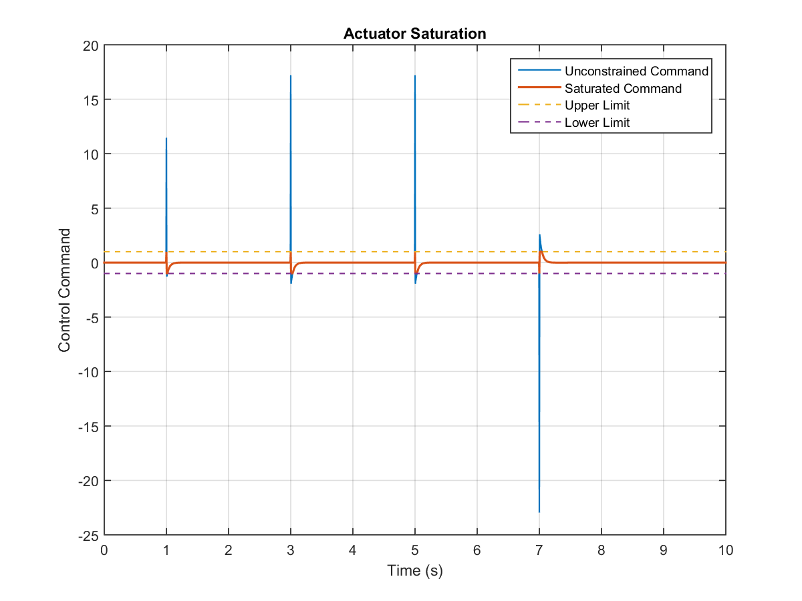
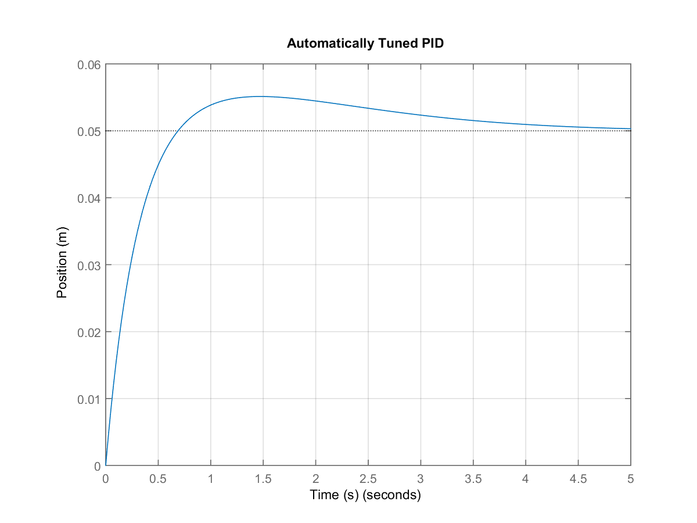

# Precision XY Stage Control Using PID, Feedforward and Disturbance Rejection

A MATLAB-based precision motion-control simulation of a simplified motor-driven XY positioning stage using closed-loop PID control.

## Overview

This project models and evaluates a precision positioning system under several practical control-system conditions:

- PID feedback position control
- Multi-position trajectory tracking
- Velocity feedforward compensation
- External disturbance rejection
- Sensor-noise analysis
- Actuator saturation
- Manual PID tuning vs. MATLAB automatic PID tuning

The project is intended as an educational/control-engineering portfolio project demonstrating the complete workflow from plant modeling and controller design to performance evaluation.

## Project Structure

```text
precision-xy-stage-control/
│
├── main.m
│
├── README.md
├── LICENSE
├── .gitignore
│
├── docs/
│   └── project_report.md
│
└── results/
    ├── 01_open_loop_response.png
    ├── 02_pid_position_response.png
    ├── 03_trajectory_tracking.png
    ├── 04_tracking_error.png
    ├── 05_feedforward_comparison.png
    ├── 06_disturbance_rejection.png
    ├── 07_sensor_noise.png
    ├── 08_actuator_saturation.png
    ├── 09_automatic_pid.png
    └── performance_results.txt
```

> `main.m` and the complete `results/` folder are the core files of the project. Keep the nine generated figures and `performance_results.txt` inside `results/`.

## System Model

The simplified mechanical model is represented by:

```text
m*x'' + b*x' = K*u
```

with the corresponding transfer function:

```text
G(s) = K / [s(ms + b)]
```

Simulation parameters:

| Parameter | Value |
|---|---:|
| Mass | 1 kg |
| Damping | 2 N.s/m |
| Motor Gain | 10 |

## PID Controller

The position controller is:

```text
C(s) = Kp + Ki/s + Kd*s
```

Manual PID gains used in the simulation:

| Gain | Value |
|---|---:|
| Kp | 18 |
| Ki | 5 |
| Kd | 3 |

## Reference Trajectory

The stage is commanded through multiple position changes:

```text
0 m → 0.02 m → 0.05 m → 0.08 m → 0.04 m
```

This allows the controller to be evaluated on changing position commands rather than only a single step input.

## Control Features

### PID Feedback Control
The PID controller minimizes the error between the desired and measured stage position.

### Velocity Feedforward
A velocity feedforward term provides additional anticipatory control action during motion transitions.

### Disturbance Rejection
A temporary external disturbance is introduced to evaluate closed-loop robustness.

### Sensor Noise
Measurement noise is added to represent non-ideal position sensing.

### Actuator Saturation
The controller output is limited to represent finite actuator capability.

### Automatic PID Tuning
MATLAB automatic PID tuning is compared with the manually selected PID controller.

## Performance Metrics

The simulation evaluates:

- Rise time
- Settling time
- Percentage overshoot
- Maximum tracking error
- RMS tracking error
- Final tracking error
- Disturbance response

The numerical results generated by `main.m` are stored in:

```text
results/performance_results.txt
```

## Results

The simulation generates nine analysis figures:

| Figure | Analysis |
|---|---|
| 01 | Open-loop response |
| 02 | PID position response |
| 03 | Trajectory tracking |
| 04 | Tracking error |
| 05 | PID vs. feedforward comparison |
| 06 | Disturbance rejection |
| 07 | Sensor noise |
| 08 | Actuator saturation |
| 09 | Automatic PID tuning |

### Open-Loop Response


### PID Position Response


### Trajectory Tracking


### Tracking Error


### PID vs Feedforward


### Disturbance Rejection


### Sensor Noise


### Actuator Saturation


### Automatic PID Tuning


## Software Requirements

- MATLAB
- Control System Toolbox

## How to Run

1. Clone or download this repository.
2. Open MATLAB.
3. Set the repository folder as the MATLAB Current Folder.
4. Run:

```matlab
clear
clc
close all
main
```

5. Check the `results/` folder for the generated plots and `performance_results.txt`.

## Skills Demonstrated

- MATLAB
- Control System Toolbox
- Transfer Function Modeling
- PID Control
- Feedback Control
- Feedforward Control
- Motion Control
- Trajectory Tracking
- Disturbance Rejection
- Sensor Noise Analysis
- Actuator Saturation
- Control Performance Analysis

## Future Improvements

Possible extensions include:

- Simulink implementation
- Cascaded position and velocity control
- PID anti-windup
- Derivative filtering
- State-space modeling
- LQR control
- Encoder feedback
- Real motor hardware implementation
- Real-time controller deployment

## Author

**Sounak Chattopadhyay**

Electrical Engineering | Control Systems | MATLAB

## Disclaimer

This project is an educational control-system simulation based on a simplified mathematical model. It does not represent proprietary hardware or control algorithms of any specific company.
